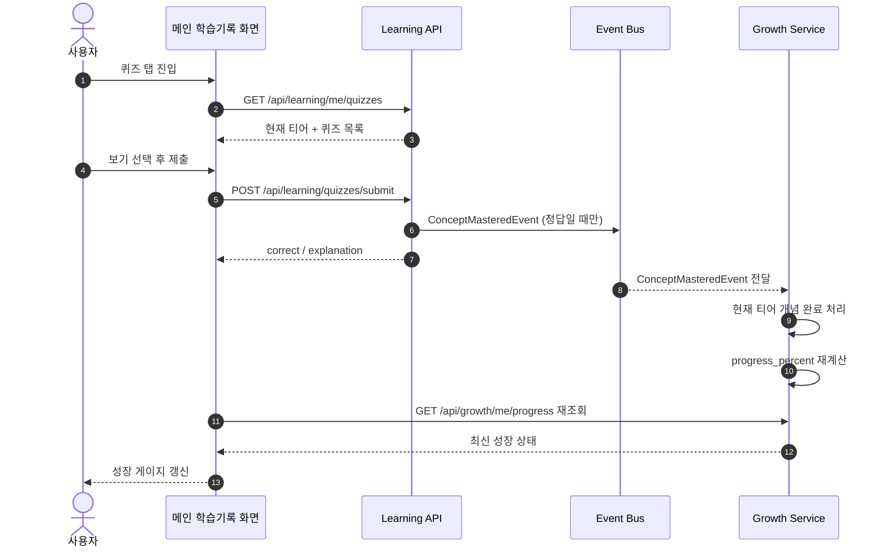

# 학습(Learning)과 성장(Growth) 연결 정리

이 문서는 `backend/docs/growth.md`, `backend/docs/learning_dataflow.md`를 기준으로,
현재 메인 화면에서 분리되어 보이던 학습 기능과 성장 기능을 어떤 과정으로 연결했는지 정리한 문서다.

---

## 1. 참고한 문서

- `backend/docs/growth.md`
- `backend/docs/learning_dataflow.md`

두 문서에서 확인한 핵심 전제는 아래와 같았다.

1. 학습 퀴즈 정답 시 `ConceptMasteredEvent`가 발행된다.
2. 성장 모듈은 이 이벤트를 구독해 이해도 게이지를 올린다.
3. 홈 화면은 `GET /api/growth/me/progress` 하나로 현재 티어, 진행도, 승급시험 가능 여부를 그릴 수 있다.

즉 설계 의도 자체는 이미 `학습 -> 이벤트 -> 성장`으로 이어지도록 되어 있었다.

---

## 2. 실제 코드에서 확인한 문제

문서를 따라가며 실제 코드를 확인했을 때, 아래 세 가지 때문에 메인 화면에서 두 기능이 연결되어 보이지 않았다.

### 2.1 퀴즈 개념 ID와 성장 개념 ID가 달랐다

기존 `features/learning/curriculum.py`는 퀴즈 개념 ID를 `1, 2, 3`으로 관리하고 있었다.

반면 성장 모듈 `features/growth/catalog.py`의 T1 개념 ID는 아래였다.

- `101` 안전마진
- `102` 내재가치
- `103` 장기 투자 관점
- `104` 변동성과 리스크의 차이
- `105` 좋은 비즈니스의 질

성장 서비스는 `process_concept_mastered_event()`에서
"현재 티어 카탈로그에 없는 개념 ID"를 무시한다.

그래서 학습 퀴즈를 맞혀도 이벤트는 발행되지만,
성장 쪽에서는 다른 개념으로 간주해 진행도가 오르지 않는 상태였다.

### 2.2 T1 승급 기준을 채우기에 퀴즈 수가 부족했다

기존 학습 커리큘럼은 샘플 3문항뿐이었다.

하지만 성장 모듈은 T1에서 총 5개 개념 중 80% 이상,
즉 4개 이상을 완료해야 승급시험이 열린다.

따라서 ID를 억지로 맞춰도 3문항만으로는 T1 승급 조건을 채울 수 없었다.

### 2.3 프론트 메인 화면의 퀴즈 섹션이 정적 목업이었다

기존 메인 화면 `frontend/src/features/growth/screens/LearningRecordScreen.tsx`는
학습 기록 화면 레이아웃은 있었지만,

- 퀴즈 목록이 서버 기반이 아니었고
- 퀴즈 제출 API를 호출하지 않았고
- 정답 뒤 성장 progress를 다시 조회하지도 않았다

즉 화면상으로는 "학습 영역"과 "성장 영역"이 나란히 있었지만,
사용자 행동으로 연결되는 구조는 아니었다.

---

## 3. 연결 목표

이번 연결 작업의 목표는 다음처럼 잡았다.

1. 메인 화면의 퀴즈는 반드시 현재 티어 기준 서버 데이터로 표시한다.
2. 퀴즈 concept ID는 성장 카탈로그와 같은 축을 사용한다.
3. 퀴즈 정답 제출 후 성장 progress를 메인에서 다시 불러와,
   사용자가 "학습 결과가 성장에 반영됐다"는 것을 같은 화면에서 확인할 수 있게 한다.
4. 이벤트 버스가 비동기이므로, 프론트는 즉시 반영을 가정하지 않고
   재조회/재동기화 단계를 둔다.

---

## 4. 백엔드에서 바꾼 점

### 4.1 학습 퀴즈 카탈로그를 성장 카탈로그 축으로 정렬

`backend/features/learning/curriculum.py`

기존 3문항 샘플 카탈로그를 제거하고,
성장 카탈로그의 티어 구조에 맞춰 퀴즈 카탈로그를 재구성했다.

- T1: `101~105`
- T2: `201~205`
- T3: `301~305`
- T4: `401~405`
- T5: `501~505`

이렇게 바꾸면서 학습 모듈이 발행하는 `ConceptMasteredEvent.concept_id`가
성장 모듈이 이해하는 개념 ID와 동일해졌다.

### 4.2 현재 티어 퀴즈 목록 API 추가

`backend/features/learning/router.py`
`backend/features/learning/schemas.py`

메인 화면이 현재 티어에 맞는 퀴즈 목록을 바로 가져갈 수 있도록
새 API를 추가했다.

- `GET /api/learning/me/quizzes`

이 API는 아래 순서로 동작한다.

1. 인증 사용자 확인
2. `user_context.get_tier()`로 현재 티어 조회
3. `curriculum.list_quizzes_for_tier(current_tier)` 호출
4. `tier + quizzes[]` 응답 반환

이렇게 해서 프론트가 더 이상 하드코딩된 퀴즈 ID나 문항을 들고 있지 않아도 되게 했다.

### 4.3 정답 제출 흐름은 기존 이벤트 설계를 유지

`POST /api/learning/quizzes/submit` 자체는 기존 구조를 유지했다.

- 정답 여부 채점
- 정답이면 `ConceptMasteredEvent` 발행
- 즉시 응답 반환

즉 동 간 결합을 높이지 않고,
기존 문서가 설명하던 이벤트 기반 연결을 그대로 살렸다.

---

## 5. 프론트엔드에서 바꾼 점

### 5.1 메인 화면 상단에 성장 카드를 고정

`frontend/src/features/growth/screens/LearningRecordScreen.tsx`

메인 화면 상단에 `GrowthProgressCard`를 배치해,
현재 티어와 이해도 게이지를 항상 먼저 볼 수 있게 했다.

성장 정보는 기존처럼

- `GET /api/growth/me/progress`

로 가져오고,
퀴즈 제출 후에도 같은 query key를 재사용해 갱신하도록 만들었다.

### 5.2 퀴즈 탭을 현재 티어 서버 데이터 기반으로 전환

정적 `quizRecords`를 제거하고,
퀴즈 탭은 아래 API 결과를 사용하게 바꿨다.

- `GET /api/learning/me/quizzes`

즉 사용자는 메인 화면에서
"지금 내 티어에서 풀 수 있는 학습 개념"
만 보게 된다.

### 5.3 퀴즈 제출 뒤 성장 progress 재동기화 추가

퀴즈 카드에서 답안을 선택해 제출하면:

1. `POST /api/learning/quizzes/submit`
2. 정답이면 성장 progress query 재조회
3. progress가 실제로 증가했는지 helper로 판별
4. 즉시 반영이 안 되면 짧게 재시도
5. 마지막에는 `invalidateQueries`로 한 번 더 최신화

를 수행하도록 만들었다.

재동기화 판단 helper는
`frontend/src/features/growth/logic.ts`의
`didGrowthProgressAdvance()`에 정리했다.

### 5.4 사용자에게 "반영 중 / 반영 완료 / 지연" 상태를 노출

이벤트 버스가 Redis Pub/Sub 기반 비동기이기 때문에,
정답 제출 직후 성장 게이지가 항상 같은 tick 안에 올라온다고 보장할 수 없다.

그래서 퀴즈 카드 안에 아래 상태를 노출하도록 했다.

- `정답 · 반영 중`
- `정답`
- `정답 · 확인 필요`

즉 사용자가 "버튼을 눌렀는데 왜 게이지가 바로 안 오르지?"라고 느끼지 않도록,
비동기 처리 특성을 UI 메시지로 설명했다.

---

## 6. 최종 연결 흐름

---

## 7. 수정한 파일

### 백엔드

- `backend/features/learning/curriculum.py`
- `backend/features/learning/router.py`
- `backend/features/learning/schemas.py`
- `backend/tests/features/test_learning.py`
- `backend/tests/features/test_learning_router.py`

### 프론트엔드

- `frontend/src/features/growth/screens/LearningRecordScreen.tsx`
- `frontend/src/features/growth/logic.ts`
- `frontend/src/features/growth/data.ts`
- `frontend/src/features/learning/api.ts`
- `frontend/src/features/learning/types.ts`
- `frontend/tests/growthLogic.test.js`

---

## 8. 검증

이번 연결 작업에서 최소 검증으로 아래를 실행했다.

### 백엔드

- `pytest tests/features/test_learning.py`
- `pytest tests/features/test_learning_router.py`
- `pytest tests/features/test_growth_service.py`

### 프론트엔드

- `npm run test:growth`
- `npm run typecheck`

---

## 9. 요약

이번 작업으로 메인 화면에서 학습과 성장이 아래처럼 연결되도록 바뀌었다.

1. 메인 퀴즈는 현재 티어 기준 서버 데이터로 노출된다.
2. 퀴즈 정답 시 성장 모듈이 이해하는 같은 concept ID로 이벤트가 발행된다.
3. 프론트는 정답 제출 뒤 성장 progress를 다시 읽어 같은 화면에서 반영 결과를 보여준다.

즉 이제 메인 화면에서 사용자가 퀴즈를 풀면,
"학습 행동"이 "성장 게이지 변화"로 이어지는 흐름을 실제로 확인할 수 있다.
